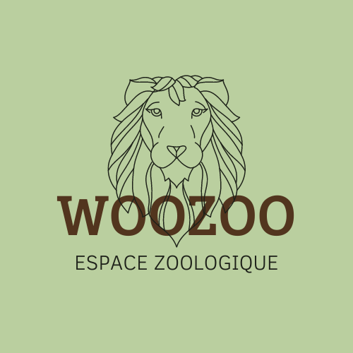

## WooZoo Project

Le projet "WooZoo" est une appli' test

## Pré requis & Installation 

DB :

...

## Technologies utilisées 

- Laravel 8.12
- Jetstream 2.3
- Inertia.js
- Bootstrap 5
- Moment.js

## Situation

Le Zoo a une année d'existence et cherche donc à développer une série de choses pour le bon fonctionnement de celui-ci au travers d'une application.

Elle gère donc un parc animalier avec des animaux qui peuvent sortir dehors ou être en cage si le Zoo est fermé, les heures de mise à disposition de la nourriture varient en fonction des animaux mais le personnel doit être prévenu par un moyen que vous définissez.

Le personnel s'attend donc à enregistrer / modifier la liste des animaux disponibles, pouvoir ajouter des animaux dans des cages spécifiques (les chats ne vont pas avec les chiens), les heures de prises de nourritures et quels aliments sont nécessaires pour l'animal.

### Qui? 

- Robby Delvaux : https://www.github.com/Delvaux1986 pour be.wan 

## Quand?

Du 01/05/2021 au 06/05/2021

## Comment?

1. Réflechir aux relations dans DB 
2. Installation environnement développement
3. Création schémas de DB
4. Création models & controllers + architecture dossier
5. Mise en place relations dans models
6. Création layout & création composants un par un
7. Création logo + palette couleurs

